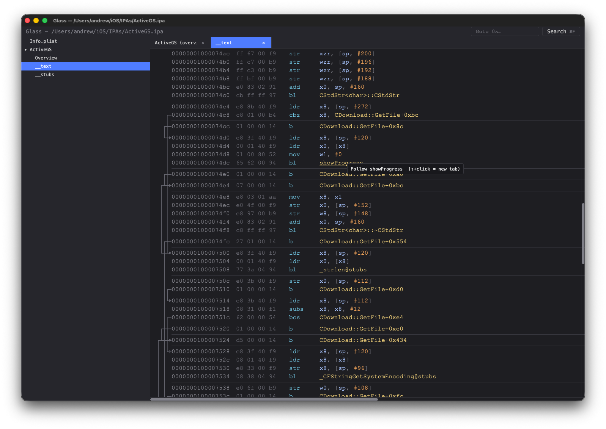
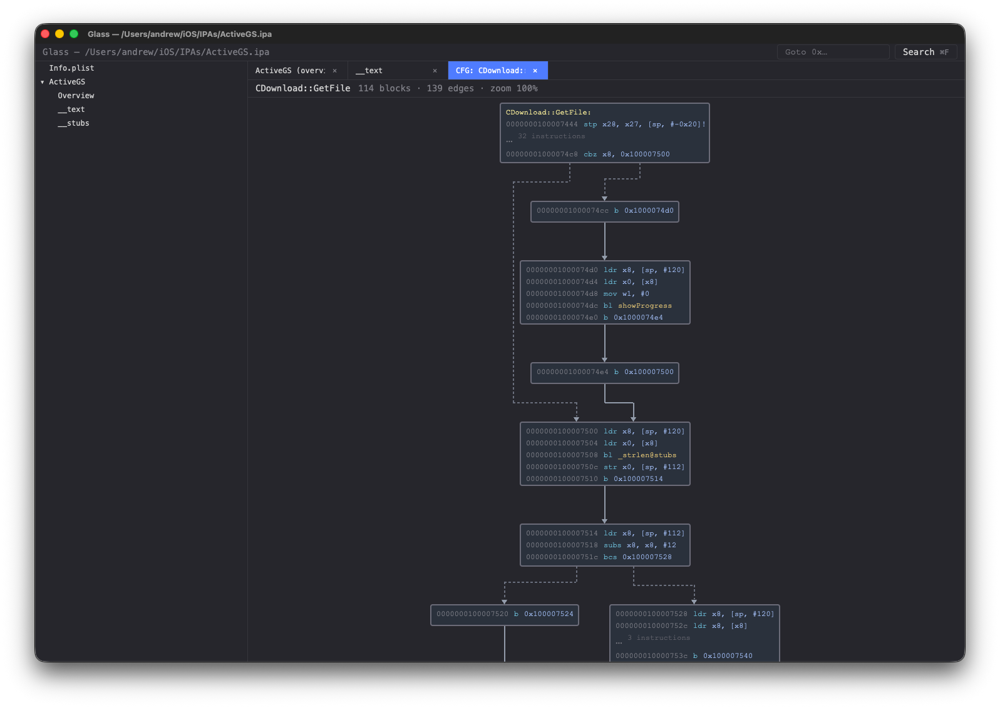
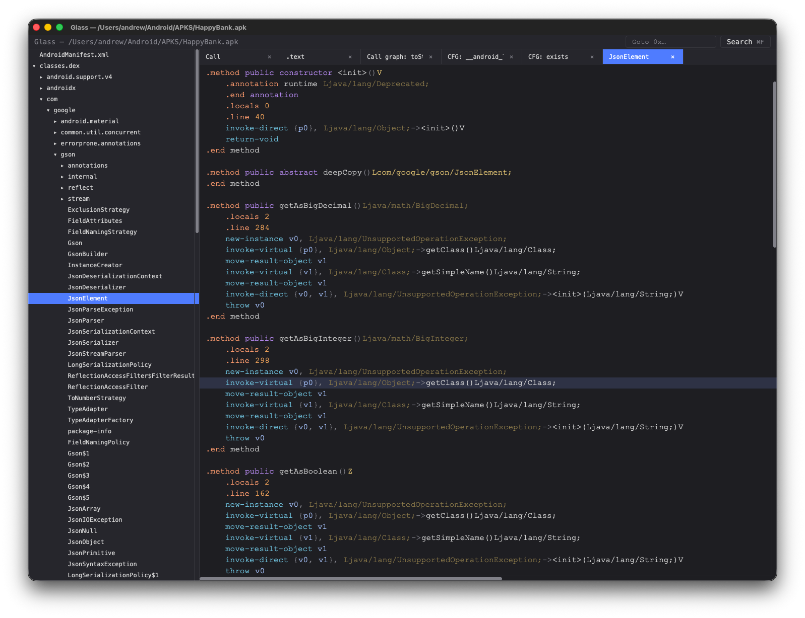
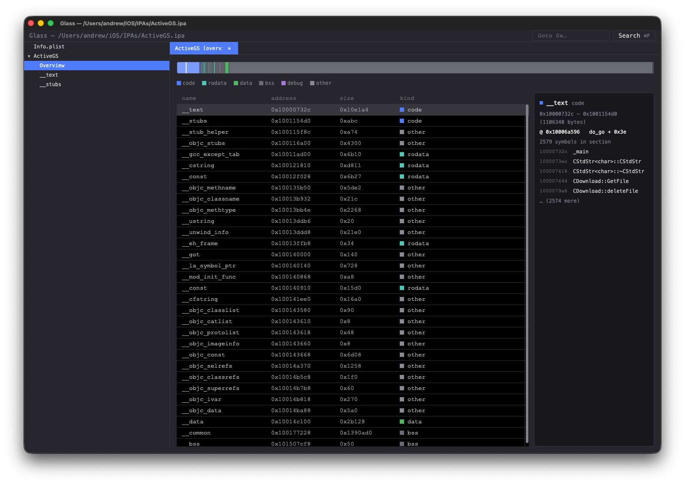

# Glass
*as in transparent and smooth*

A fast, native, **mobile-app first** interactive disassembler. Spiritual successor to IDA Pro for the Android / iOS reverse engineering workflow, built around:

- `smali` for APK / DEX / smali handling
- `armv8-encode` for AArch64 (native `.so`, iOS Mach-O)
- `gpui` (Zed) for GPU-accelerated native UI
- `redb` for content-addressed persistence
- `rquickjs` for scriptable plugins (planned)

License: GPL-3.0-only (inherited from `smali`).

## Why?

We’ve all used IDA Pro — it’s the industry standard for reversing and has years of plugins behind it, but it’s slow, expensive, and dated. Glass is 100% Rust native with a GPU-accelerated UI for fluid interaction. It’s also 100% free and open source — please contribute.

## Features
* Buttery smooth 120fps GPU accelerated rendering
* Lightning fast analysis: 1-2 seconds for most larger binaries compared with minutes on IDA Pro
* Fully linked and annotated disassemblies with control flow lines, data literals in comments, clickable links to other functions. All coloured for easy visibility.
* Control flow graphs showing basic blocks and clickable links to other functions
* Full project search for symbols or string literals across DEX, code and data sections
* Native binary layout overview with section data
* Xref search of callers, references to data
* Binary search of sequences of bytes with masking and gaps across code and data
* Search for asm instructions or patterns of instructions across all sections 
* Annotate any line (code or data) with a colour and/or comment so you can easily find it again later. 
* In place editing of instructions and data (double-click on item), rebuild the app for export.
* Themes for Glass and also selectable background colours for each workspace.


## Screenshots

A walk through the main views — click any thumbnail to see it full size.

<table>
  <tr>
    <td align="center">
      <a href="screenshots/disassembly.png">
        
      </a>
      <br/>
      <sub><b>Disassembly listing</b><br/>colour-coded operands, control-flow arrows, resolved string literals inline</sub>
    </td>
    <td align="center">
      <a href="screenshots/cfg.png">
        
      </a>
      <br/>
      <sub><b>Control flow graph</b><br/>per-function CFG with dotted conditional edges and routed multi-rank lanes</sub>
    </td>
  </tr>
  <tr>
    <td align="center">
      <a href="screenshots/dex.png">
        
      </a>
      <br/>
      <sub><b>DEX call graph</b><br/>hover-to-expand callees, click to jump to the method's smali</sub>
    </td>
    <td align="center">
      <a href="screenshots/overview.png">
        
      </a>
      <br/>
      <sub><b>Section-map overview</b><br/>proportional bar by section size, click to jump to listing / hex view</sub>
    </td>
  </tr>
</table>

## Scripting

Every analysis Glass does in the GUI is also exposed as a CLI verb that emits structured JSON. The same `glass` binary is the automation entry point — pick a subcommand and you get a one-shot, scriptable result, perfect for `jq` pipelines and CI.

```sh
# What classes ship in this APK?
glass classes ./app.apk --package com.example. --text

# Who calls glass::main, by address?
glass callers ./libfoo.so --artifact libfoo.so --symbol "glass::main"

# Every `onCreate` across DEX, machine-readable:
glass search ./app.apk onCreate | jq '.data.hits[] | select(.kind=="method")'
```

Pass `--text` for a human-readable rendering, omit it for JSON.

Full reference: **[docs/cli-api.md](docs/cli-api.md)**.

This means you can script and automate common operations. 


## Skills and MCP

Every CLI verb is also exposed as a tool through an inbuilt MCP (Model Context Protocol) server, so any MCP-aware host — Claude Desktop, Cursor, Zed, your own client — can drive Glass directly to help with reversing tasks.

```sh
# Print the machine-readable skill catalog (one JSON object listing
# every verb with its schema and an example invocation).
glass skills

# Run as an MCP stdio server. Plug into any MCP host's tool list.
glass mcp
```

To register with **Claude Desktop**, add Glass to `~/Library/Application Support/Claude/claude_desktop_config.json`:

```json
{
  "mcpServers": {
    "glass": { "command": "/usr/local/bin/glass", "args": ["mcp"] }
  }
}
```

The model can then call `inspect`, `symbols`, `disasm`, `cfg-of`, `dex-callers`, `search` and every other verb on any bundle you point it at. Tool results come back as the same JSON envelope you'd get from the CLI.


## Searching

Three complementary engines, all available from the same ⌘F palette in the GUI and as CLI / MCP verbs.

### Full text search

Bundle-wide fuzzy match across native symbols, DEX classes / methods / fields, and string literals in code and data sections. Live-filtered as you type; results dispatch to the right view (listing for native addresses, smali viewer for DEX targets, hex view for data hits). Indices build on a background thread after load — a progress chip shows while in flight.

```sh
glass search ./app.apk onCreate                 # all things named like "onCreate"
glass search ./libfoo.so init --limit 20
```

CLI reference: [`search` verb in `docs/cli-api.md`](docs/cli-api.md#search--path-p---query-q---limit-n).

### Binary search

Byte-level pattern engine. Each atom is a 2-character hex mask (`c0`, `e?`, `?f`, `??`) or a gap (`*` = 0..=32 bytes, `*(min..max)` for explicit bounds). Matches don't span sections. In the GUI palette, ⌘2 switches to Binary mode; the **Code only** checkbox (default on) restricts the scan to text sections so you aren't drowning in data hits when looking for an instruction shape.

```sh
# returning-true stub finder — `mov w0, #1 ; ret`
glass bin-search ./libfoo.so --artifact libfoo.so --pattern '20 00 80 52 c0 03 5f d6'

# any ADRP+ADD pair with no intervening bytes
glass bin-search ./libfoo.so --artifact libfoo.so --pattern '?? ?? ?? 9? ?? ?? 4? 91'

# raw data: find embedded magic
glass bin-search ./libfoo.so --artifact libfoo.so --pattern 'de ad be ef'
```

Full grammar + worked examples: [`docs/BinSearch.md`](docs/BinSearch.md).

### Instruction search

Write the assembly, Glass compiles it to bytes. A `;`-separated AArch64 sequence is encoded via [armv8-encode](https://github.com/azw413/armv8-encode), and any wildcards are translated to operand-bit masks before the byte engine takes over. Inside Binary mode in the GUI, ⌘B toggles between **Bytes** and **Asm** grammars; an autocomplete dropdown shows variants that still match what you've typed.

Wildcards:

| Token | Meaning |
|---|---|
| `*` | any operand (kind inferred from the chosen opcode) |
| `#*` | any immediate (hints the opcode picker) |
| `x`, `w` | any X- or W-class register |
| `<*>`, `<X>`, `<W>`, `<imm>` | bracketed equivalents, useful nested in other syntax (`[x, #*]`) |

```sh
# every `mov w0, #N` (any N)
glass insn-search ./libfoo.so --artifact libfoo.so --pattern 'mov w0, #*'

# any ADRP into x1 followed immediately by ADD into the same reg
glass insn-search ./libfoo.so --artifact libfoo.so --pattern 'adrp x1, * ; add x1, x1, #*'

# every `ret x30` — concrete, no wildcards
glass insn-search ./libfoo.so --artifact libfoo.so --pattern 'ret'
```

The response carries `bytes_hex` showing the compiled mask (e.g. `01/1f ?? ?? 90/9f` for `adrp x1, *`) so you can see exactly which bits are pinned vs wildcarded. Captures (`<name:kind>` cross-referencing the same operand later in the pattern) are designed but not yet implemented.

Full design + phasing: [`docs/InsnPattern.md`](docs/InsnPattern.md). CLI/MCP reference: [`insn-search` in `docs/cli-api.md`](docs/cli-api.md#insn-search--path-p---artifact-a---pattern----section-s---limit-n).


## Current Status

Glass is usable today for reversing both Android (APK / DEX / native `.so`) and iOS (IPA / Mach-O) apps targeting AArch64. 32-bit ARM is on the roadmap.

### What works

**File loading**
- Open Android bundles (`.apk`, `.aab`), iOS bundles (`.ipa`), or any standalone ELF / Mach-O binary (`.so`, `.dylib`, raw executables) directly — Glass auto-detects the format.
- Fat / universal Mach-O is handled transparently: `arm64e` is preferred, plain `arm64` is the fallback. Works on bundles and on standalone files alike (e.g. `glass gui /usr/lib/dyld`).
- Loader pipeline reports progress (Reading archive → Parsing DEX / Disassembling native → Building symbols).
- Per-artifact content-addressed IDs (blake3, rayon-parallel for large libs). Annotations follow the artifact, not the container — the same `libfoo.so` shipped in two APKs (or the same `libswiftCore.dylib` across two IPAs) shares analysis state.
- AndroidManifest viewer (binary XML decoded via `smali`).
- Info.plist viewer for iOS bundles — bundle id, executable name, version, min OS, and the rest of the plist rendered as colour-coded XML.

**iOS — IPA / Mach-O**
- Unzip the IPA, locate `Payload/*.app/`, parse `Info.plist`, and pick the arm64 / arm64e slice from any fat binary inside.
- Main executable and every `Frameworks/*.framework` + `*.dylib` is loaded as its own native artifact, with the same Overview + per-section disassembly views used for Android `.so` files.

**Android — APK / DEX / native**
- Class tree across all DEX files in the APK.
- Smali listing per class with syntax-aware tokenization (directives, types, method names, string literals, etc.).
- Method cross-references resolve to the right class + line.
- Native `.so` files under `lib/<abi>/` loaded per ABI; AArch64 gets disassembly, other ABIs route to the hex view.

**AArch64 native (ELF + thin Mach-O)**
- Linear-sweep disassembly with virtualized rendering — large libraries open in seconds, not minutes.
- Symbol map merged from ELF symtab, dynsym, DWARF, `.eh_frame` FDEs, and synthesized `<name>@plt` entries. C++/Rust/Swift demangling via `symbolic-demangle`.
- Branch operands rendered as clickable symbol references; `adrp` + `add`/`ldr` pairs resolved to data targets, including string literals shown inline as comments.
- Per-section views (code sections get disassembly; data sections get a hex view).

**UI**
- Tabbed right pane with overflow-safe dropdown, close buttons, click-to-activate.
- Horizontal + vertical scrollbars on listing, hex, and manifest views.
- Cmd-F symbol palette with fuzzy filter.
- Right-click cross-references in every view: **References to address** / **Callers of function** in the listing, hex and CFG; **Callers of method** / **References to field** in smali. Results show in the palette with a scope chip; Esc clears the scope back to bundle-wide search. Indices build on a background thread after load — a progress chip shows while in flight.
- Cmd-O open, Cmd-N new window. macOS app menu with **File → Open Recent** (last 10 bundles).
- Window bounds + open tabs + tree expansion state persisted per-bundle in `redb`; relaunching reopens where you left off.

### What's missing

- armv7 / x86 disassembly (non-AArch64 code sections currently route to the hex view).
- iOS entitlements and `embedded.mobileprovision` parsing.
- Swift metadata pass — Swift Mach-O symbol stubs are sparse without it.
- ObjC `__objc_classlist` extraction.
- GUI editor for renames / comments / colours (writes already work via `glass set-rename` / `set-comment` / `set-colour` and over MCP — the listing just doesn't render them yet).
- Cross-references DEX ↔ native via JNI signatures.
- QuickJS scripting host.
- Drag-to-scroll on scrollbars (currently visual-only — use trackpad / wheel).
- Resource ID decoding in the manifest (would need `resources.arsc` parsing).

## Building

Glass runs on **macOS 13+** (the primary target, GPU-accelerated via Metal — no extra SDK needed, the Metal framework ships with the OS) and **Linux** (X11 or Wayland via `gpui_linux`, Vulkan-backed). A Windows port is on the roadmap.

There is a release prebuilt binary for macOS under Releases but if you need to build from source: the good news: it's two commands.

1. **Install Rust** (if you don't already have it):

   ```sh
   curl --proto '=https' --tlsv1.2 -sSf https://sh.rustup.rs | sh
   ```

2. **Linux only — install gpui's native dependencies.** The easiest way is to run Zed's setup script, which knows about apt / dnf / pacman / etc:

   ```sh
   curl -sSL https://raw.githubusercontent.com/zed-industries/zed/main/script/linux | bash
   ```

   This pulls in `libxkbcommon-dev`, the Wayland and XCB headers, Vulkan, ALSA, and the rest of the toolchain `gpui_linux` needs to link. Without these the build fails at link time with missing `xkbcommon` / `wayland-client` symbols.

3. **Clone and build**:

   ```sh
   git clone https://github.com/azw413/Glass.git
   cd glass
   cargo build --release -p glass-cli
   cp target/release/glass <to somewhere on your PATH>
   ```
   
   The first build will compile `gpui` and friends and will take several minutes. Subsequent builds are fast.
   
4. **Run it**:

   ```sh
   # Open the GUI on an Android APK or iOS IPA — no subcommand needed.
   glass ~/path/to/app.apk
   glass ~/path/to/app.ipa
   
   # Or on a standalone binary — ELF .so, Mach-O .dylib, or raw
   # executable. Fat / universal Mach-O is sliced automatically.
   glass ~/path/to/libfoo.so
   glass ~/path/to/libBar.dylib
   glass /usr/lib/dyld
   
   # No args → opens an empty Glass window; use File → Open.
   glass
   
   # Headless bundle inspect
   glass bundle ~/path/to/app.apk
   
   # Inspect persisted state for a bundle
   glass db-dump ~/path/to/app.apk
   ```

Always use the release build — debug builds disassemble orders of magnitude slower.

### Packaging a `.app` bundle

To wrap the release binary in a Glass.app bundle for double-click launch from Finder:

```sh
cargo build --release -p glass-cli
./packaging/make-app.sh
open dist/Glass.app
```

The bundle is ad-hoc signed (not Developer-ID signed / notarized), so on first launch macOS will refuse to open it; right-click → **Open** to bypass Gatekeeper once.

Two ways to grab a prebuilt zip without building locally:

- **Latest `main`** — every push uploads a `Glass-app-<sha>.zip` as a 14-day workflow artifact. Pull it from the [Actions tab](https://github.com/azw413/Glass/actions).
- **Tagged release** — pushing a `v*` tag (e.g. `v0.1.0`) triggers the same workflow and additionally publishes a `Glass-<tag>-macOS.zip` to the [Releases page](https://github.com/azw413/Glass/releases) with auto-generated release notes.

## Workspace

| Crate              | Purpose                                                       |
|--------------------|---------------------------------------------------------------|
| `glass-core`       | Shared types (`CodeKind`, IDs)                                |
| `glass-arch-arm64` | AArch64 disassembly, symbol map, PLT synthesis, demangling    |
| `glass-arch-dex`   | DEX / smali facade over `smali`                               |
| `glass-mobile`     | APK + IPA bundle loading, native-lib extraction, manifest     |
| `glass-db`         | Content-addressed persistence (redb): bundles, tabs, settings |
| `glass-ui`         | `gpui` front-end: tree, listing, hex, manifest, palette       |
| `glass-cli`        | Headless inspector + GUI launcher                             |
| `glass-script`     | QuickJS plugin runtime (placeholder)                          |

## Roadmap

- **iOS deeper** — Entitlements, `embedded.mobileprovision`, ObjC `__objc_classlist`, Swift metadata pass.
- **armv7** — 32-bit ARM disassembly for older `.so` variants.
- **Internal Scripting** — QuickJS plugin host with a stable API for analysis passes.
- **Advanced** — Signed APK rebuilding.
